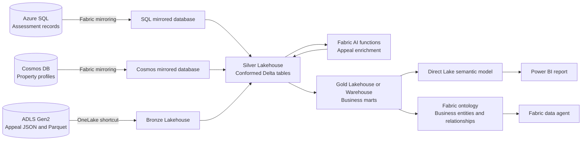
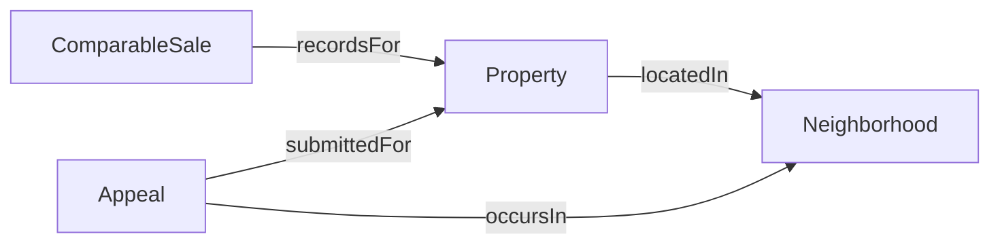

# Architecture and data schemas

The lab environment supplies three source services. Their resource names and
credentials vary by environment, so the architecture uses logical names only.

## Lab naming conventions

The notebooks rely on a small naming contract. Required names keep the
medallion flow consistent; suggested names can be changed in notebook parameter
cells.

| Item | Required or suggested name | Where it is referenced |
|---|---|---|
| Bronze Lakehouse | **Required:** `BronzeLakehouse` | Notebook 3 and the ADLS shortcut |
| Silver Lakehouse | **Required:** `SilverLakehouse` | Notebooks 1, 2, 3, and 3a |
| Gold Lakehouse | **Required:** `GoldLakehouse` | Notebook 4 |
| Silver and Gold schema | **Required:** `dbo` | Managed Delta table names |
| ADLS shortcut | **Required:** `appeals` under `BronzeLakehouse/Files` | Appeal Parquet path |
| SQL mirrored database | **Suggested:** `Property Assessment SQL Mirror` | `sql_mirror_item` in notebook 1 |
| Cosmos mirrored database | **Suggested:** `Property Profiles Mirror` | `cosmos_mirror_item` in notebook 2 |
| Foundry Variable Library | **Suggested:** `HackathonVariables` | `variable_library_name` in notebook 3a |
| Gold semantic model | **Suggested:** `Property Assessment Model` | Goal 4 |
| Power BI report | **Suggested:** `Property Assessment Insights` | Goal 4 |
| Fabric ontology | **Required:** `PropertyAssessmentOntology` | Goal 4 and notebook 5 |
| Fabric data agent | **Suggested:** `Property Assessment Agent` | Goal 4 |

Create `SilverLakehouse` and `GoldLakehouse` with **Lakehouse schemas enabled**.
Mirror names are deliberately dynamic: update the parameter value instead of
renaming an environment-owned Fabric item. If a required Lakehouse or shortcut
name must change, update every dependent notebook parameter or path before
running the labs.

### Foundry Variable Library values

Notebook 3a reads environment configuration from the active value set in the
Variable Library. Define:

| Variable | Required | Purpose |
|---|---|---|
| `foundry_endpoint` | Yes | Azure OpenAI-compatible model endpoint exposed by the Foundry resource |
| `chat_deployment` | Yes | Chat-model deployment name |
| `api_version` | Yes | API version supported by the deployment |
| `key_vault_uri` | Only for key authentication | Key Vault URI containing the API key |
| `foundry_key_secret_name` | Only for key authentication | Secret name holding the API key |

When the Key Vault variables are blank, notebook 3a uses the notebook user's
Entra token. Never place an endpoint key directly in a committed notebook.

## End-to-end architecture



The semantic model and ontology have different jobs. The semantic model
provides report relationships, measures, and business calculations. The
ontology binds Gold rows to `Property`, `Neighborhood`, `ComparableSale`, and
`Appeal` entities and exposes their relationships to agents and graph queries.
See the [Goal 4 ontology guide](Fabric%20Hackathon%20-%20Goal%204%20-%20Ontology.md)
for the complete binding contract.

## Shared business keys

| Key | Purpose |
|---|---|
| `parcelId` / `ParcelId` | Joins parcels, assessments, sales, property profiles, inspections, and appeals |
| `neighborhoodId` / `NeighborhoodId` | Groups properties for spatial and valuation comparisons |
| `taxYear` / `TaxYear` | Aligns assessments, rates, appeals, and reporting periods |
| `propertyClassCode` / `PropertyClassCode` | Applies valuation and tax logic by property class |

Normalize key casing and data types in Silver before joining sources.

## Azure SQL schema

Azure SQL is the relational system of record. Fabric mirroring makes these
tables available in OneLake without embedding a source server or database name
in participant assets.

### `Jurisdiction`

| Column | Type | Description |
|---|---|---|
| `JurisdictionId` | integer, primary key | Synthetic jurisdiction identifier |
| `JurisdictionName` | string | Fictional municipality name |
| `CountryCode` | two-character string | Configurable country code |
| `RegionCode` | string | Configurable province or state code |
| `CurrencyCode` | three-character string | Reporting currency |
| `AreaUnit` | string | Measurement unit used by the source |
| `IsSynthetic` | boolean | Must always be true |

### `Neighborhood`

| Column | Type | Description |
|---|---|---|
| `NeighborhoodId` | string, primary key | Stable neighbourhood key |
| `JurisdictionId` | integer, foreign key | Parent jurisdiction |
| `NeighborhoodName` | string | Display name |
| `MarketArea` | string | Urban, suburban, rural, waterfront, or mixed-use grouping |

### `PropertyClass`

| Column | Type | Description |
|---|---|---|
| `PropertyClassCode` | string, primary key | Residential, multi-unit, commercial, or agricultural code |
| `PropertyClassName` | string | Display label |
| `Description` | string | Class definition |

### `Parcel`

| Column | Type | Description |
|---|---|---|
| `ParcelId` | string, primary key | Shared synthetic property key |
| `ParcelNumber` | string, unique | Fabricated roll-style identifier |
| `NeighborhoodId` | string, foreign key | Neighbourhood relationship |
| `PropertyClassCode` | string, foreign key | Property classification |
| `SyntheticAddress` | string | Fabricated street address |
| `PostalArea` | string | Fabricated postal-style area |
| `Latitude`, `Longitude` | decimal | Demonstration map point |
| `LotAreaSquareMetres` | decimal | Synthetic site area |
| `ZoningCode` | string | Demonstration zoning category |

### `Building`

| Column | Type | Description |
|---|---|---|
| `BuildingId` | integer, primary key | Building record identifier |
| `ParcelId` | string, foreign key | Parent parcel |
| `BuildingType` | string | Residential, multi-unit, commercial, or agricultural type |
| `YearBuilt` | integer | Synthetic construction year |
| `FloorAreaSquareMetres` | decimal | Building floor area |
| `Storeys` | decimal | Number of storeys |
| `ConditionCode` | string | Fair, average, good, or excellent |
| `Bedrooms`, `Bathrooms` | numeric, nullable | Residential attributes |

### `Assessment`

| Column | Type | Description |
|---|---|---|
| `AssessmentId` | integer, primary key | Assessment record |
| `ParcelId` | string, foreign key | Assessed parcel |
| `TaxYear` | integer | Reporting year |
| `ValuationDate` | date | Effective valuation date |
| `LandValue` | decimal | Synthetic land component |
| `ImprovementValue` | decimal | Synthetic building component |
| `AssessedValue` | computed decimal | Land plus improvement value; derived again in Silver because SQL mirroring may omit computed columns |
| `ConfidenceScore` | decimal | Demonstration model-confidence measure |
| `AssessmentStatus` | string | Assessment workflow status |

### `Sale`

| Column | Type | Description |
|---|---|---|
| `SaleId` | integer, primary key | Sale transaction |
| `ParcelId` | string, foreign key | Sold parcel |
| `SaleDate` | date | Synthetic transaction date |
| `SalePrice` | decimal | Synthetic transaction value |
| `SaleType` | string | Transaction category |
| `IsArmsLength` | boolean | Indicates suitability for comparable-sales analysis |

### `TaxRate`

| Column | Type | Description |
|---|---|---|
| `TaxYear`, `PropertyClassCode` | composite primary key | Rate scope |
| `MunicipalRate` | decimal | Illustrative local component |
| `RegionalRate` | decimal | Illustrative regional component |
| `EducationRate` | decimal | Illustrative education component |

`vw_PropertyTaxRoll` combines parcels, assessments, classes, neighbourhoods,
and rates to expose `CombinedRate` and `EstimatedTax`.

## Cosmos DB schema

Each item in the `properties` container is a property profile. The logical
partition key is `/neighborhoodId`, and `id` matches `parcelId`.

```json
{
  "id": "SUD-00001",
  "parcelId": "SUD-00001",
  "documentType": "propertyProfile",
  "synthetic": true,
  "jurisdiction": {
    "name": "Sudsberry",
    "countryCode": "CA",
    "regionCode": "ON",
    "currencyCode": "CAD",
    "areaUnit": "squareMetres"
  },
  "neighborhoodId": "LAKE",
  "neighborhoodName": "Lake Junction",
  "location": {
    "type": "Point",
    "coordinates": [-81.06, 46.43]
  },
  "site": {
    "syntheticAddress": "101 Boreal Avenue",
    "propertyClassCode": "RES",
    "zoningCode": "R-1",
    "lotAreaSquareMetres": 429
  },
  "building": {
    "type": "semiDetachedResidence",
    "yearBuilt": 1956,
    "floorAreaSquareMetres": 86,
    "storeys": 2,
    "condition": "good",
    "attributes": {
      "energyRetrofitObserved": false,
      "accessoryStructureObserved": false,
      "renovationObserved": false
    }
  },
  "currentAssessment": {
    "taxYear": 2026,
    "assessedValue": 220000,
    "confidenceScore": 0.82,
    "status": "certified"
  },
  "inspections": [
    {
      "inspectionId": "INS-00001-01",
      "inspectionDate": "2026-01-12",
      "inspectionType": "exteriorReview",
      "condition": "good",
      "observations": ["building condition reviewed"],
      "followUpRequired": false
    }
  ]
}
```

Silver transformation should flatten `jurisdiction`, `site`, `building`, and
`currentAssessment` into a property table and explode `inspections[]` into a
separate inspection fact.

## ADLS JSON and Parquet schema

The ADLS shortcut exposes equivalent JSON and Parquet representations of the
assessment appeal dataset. Select one format for your pipeline and use the
other to compare schema inference and performance.

| Column | Logical type | Description |
|---|---|---|
| `appealId` | string | Synthetic appeal key |
| `parcelId` | string | Shared parcel key |
| `neighborhoodId` | string | Neighbourhood key |
| `taxYear` | integer | Appealed assessment year |
| `submittedDate` | date/string | Submission date |
| `reasonCode` | string | Supplied appeal category |
| `narrative` | string | Text used for AI enrichment |
| `requestedAdjustmentPct` | decimal | Requested percentage adjustment |
| `status` | string | Submitted, under review, or resolved |
| `outcome` | string, nullable | Resolution result |
| `resolvedDate` | date/string, nullable | Resolution date |
| `groundTruthSentiment` | string | Positive, neutral, or negative evaluation label |
| `currencyCode` | string | Reporting currency |
| `countryCode`, `regionCode` | string | Configurable jurisdiction fields |
| `synthetic` | boolean | Must always be true |

## Recommended Silver model

| Silver table | Grain | Primary source |
|---|---|---|
| `dim_jurisdiction` | one row per jurisdiction | SQL |
| `dim_neighborhood` | one row per neighbourhood | SQL |
| `dim_property_class` | one row per property class | SQL |
| `dim_parcel` | one row per parcel | SQL |
| `dim_building` | one row per building | SQL |
| `fact_assessment` | one row per parcel and tax year | SQL |
| `fact_sale` | one row per sale | SQL |
| `property_profile` | one row per parcel profile | Cosmos DB |
| `fact_inspection` | one row per inspection | Cosmos DB |
| `fact_appeal` | one row per appeal | ADLS |
| `fact_appeal_ai` or `fact_appeal_foundry_ai` | one row per enriched appeal | ADLS plus the selected AI path |

## Recommended Gold marts

- `property_assessment_mart`: parcel, class, neighbourhood, building, latest
  assessment, estimated tax, and latest inspection.
- `comparable_sales_mart`: arm's-length sales matched to the closest available
  assessment tax year, with assessment-to-sale ratios.
- `appeal_intelligence_mart`: appeal lifecycle plus AI sentiment, summary,
  classification, and urgency.
- `neighborhood_equity_mart`: valuation, sales-ratio, appeal-rate, and sentiment
  aggregates by neighbourhood.

## Recommended ontology model

`PropertyAssessmentOntology` binds directly to the managed Gold marts:



Entity keys are `parcel_id`, `neighborhood_id`, `sale_id`, and `appeal_id`.
Relationship bindings use the Gold table that contains both endpoint keys.
The original appeal narrative is excluded from ontology bindings; the governed
AI summary and classification fields remain available.

---

**Navigation:** [Previous: Introduction](Fabric%20Hackathon%20-%200%20-%20Intro.md) | [Next: Goal 1](Fabric%20Hackathon%20-%20Goal%201.md)
